```
## Loss AT to GC, FAM, B1_Mus1, motifNumber = 1
```

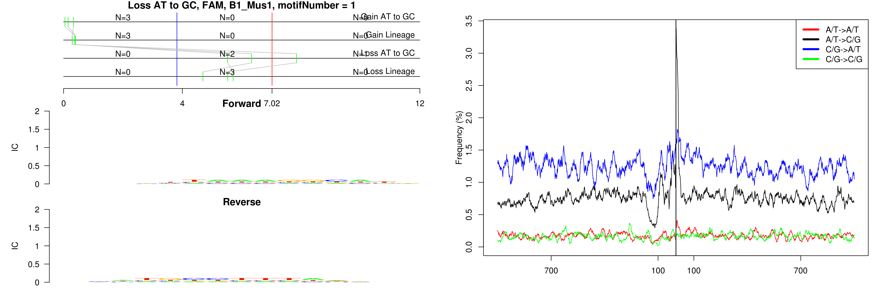 

```
## Loss AT to GC, FAM, (GAA)n, motifNumber = 1
```

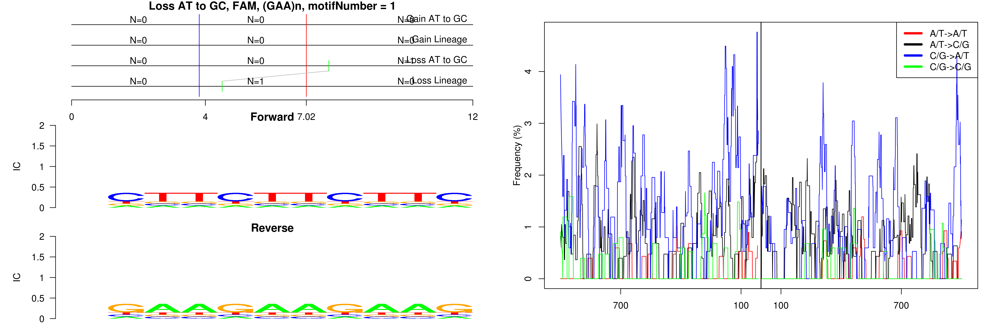 

```
## Loss AT to GC, FAM, Lx8, motifNumber = 1
```

 

```
## Loss AT to GC, FAM, MTC, motifNumber = 1
```

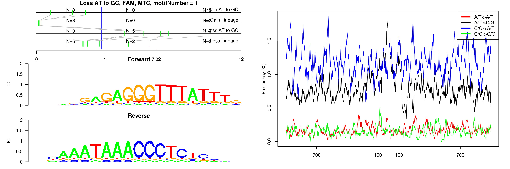 

```
## Loss AT to GC, FAM, nonRepeat, motifNumber = 1
```

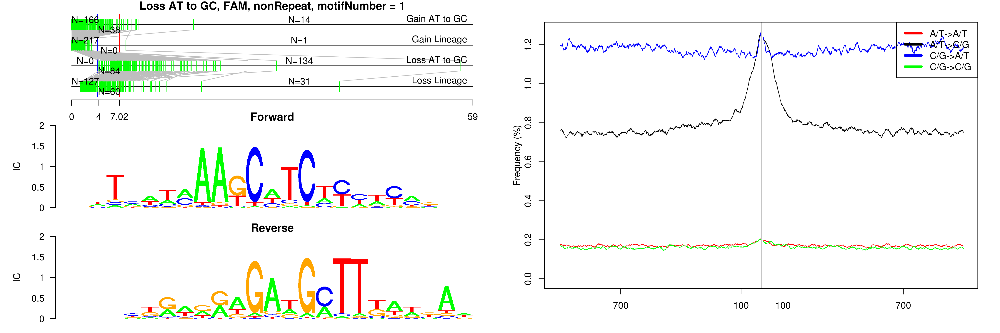 

```
## Loss AT to GC, FAM, nonRepeat, motifNumber = 2
```

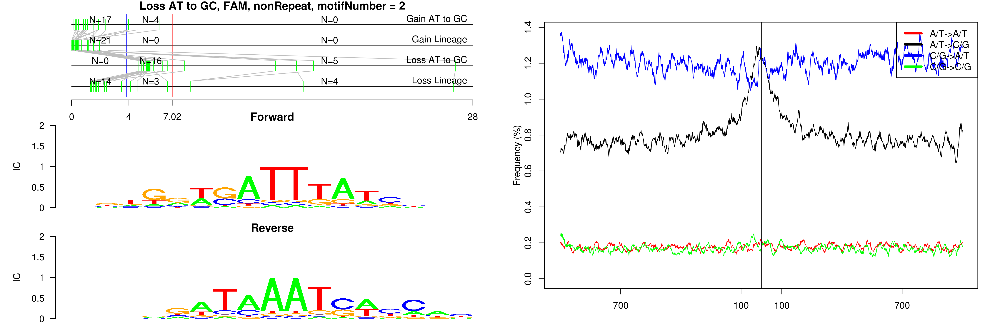 

```
## Loss AT to GC, FAM, nonRepeat, motifNumber = 3
```

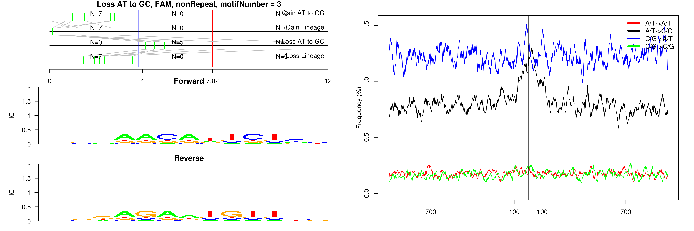 

```
## Loss AT to GC, FAM, nonRepeat, motifNumber = 4
```

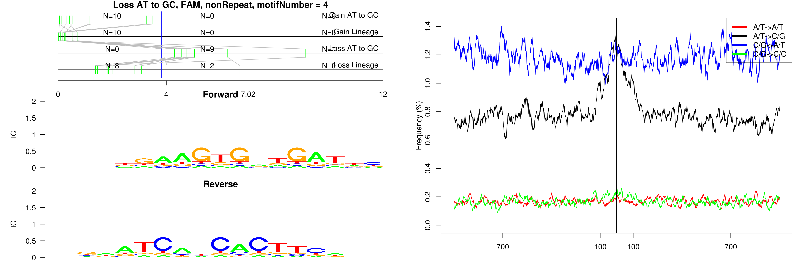 

```
## Loss AT to GC, FAM, nonRepeat, motifNumber = 5
```

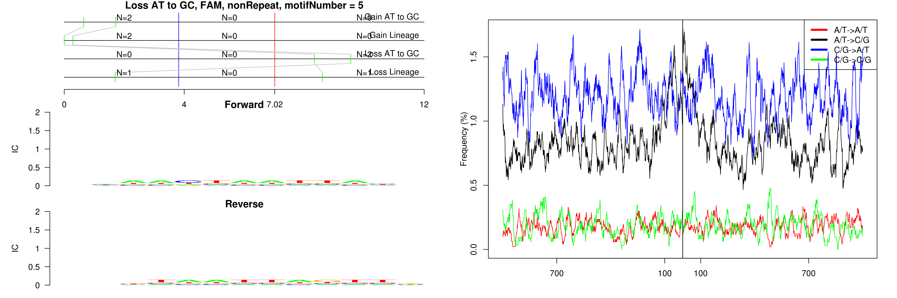 

```
## Loss AT to GC, FAM, nonRepeat, motifNumber = 6
```

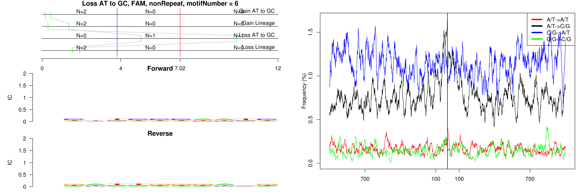 

```
## Loss AT to GC, FAM, nonRepeat, motifNumber = 7
```

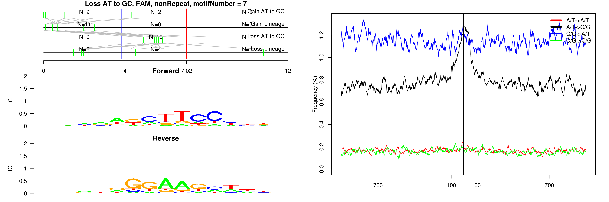 

```
## Loss AT to GC, FAM, nonRepeat, motifNumber = 8
```

 

```
## Loss AT to GC, FAM, nonRepeat, motifNumber = 9
```

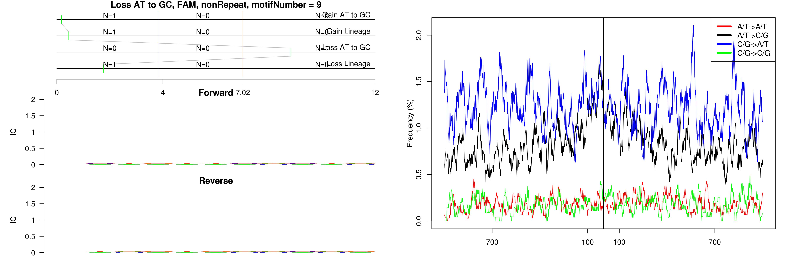 

```
## Loss AT to GC, FAM, nonRepeat, motifNumber = 10
```

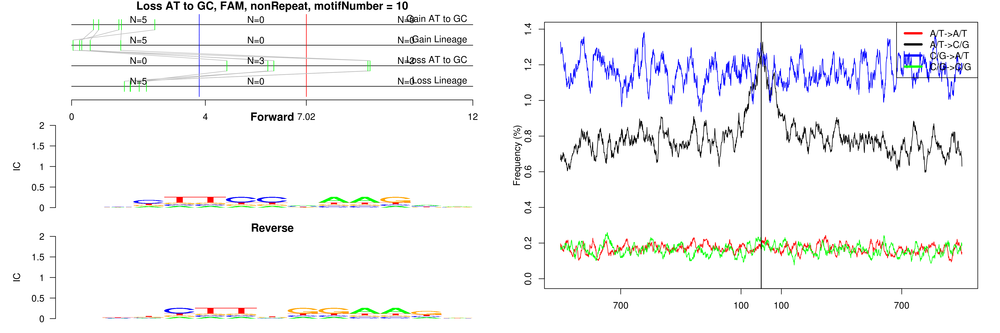 

```
## Loss AT to GC, FAM, nonRepeat, motifNumber = 11
```

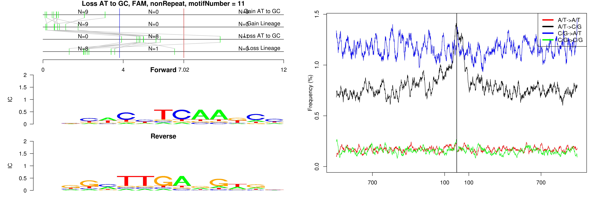 

```
## Loss AT to GC, FAM, nonRepeat, motifNumber = 12
```

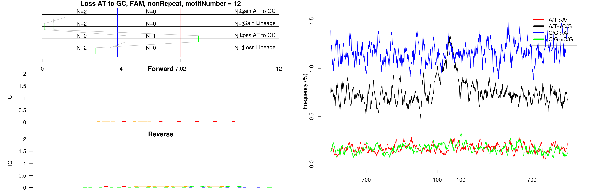 

```
## Loss AT to GC, FAM, nonRepeat, motifNumber = 13
```

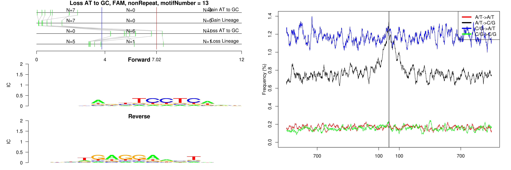 

```
## Loss AT to GC, FAM, nonRepeat, motifNumber = 14
```

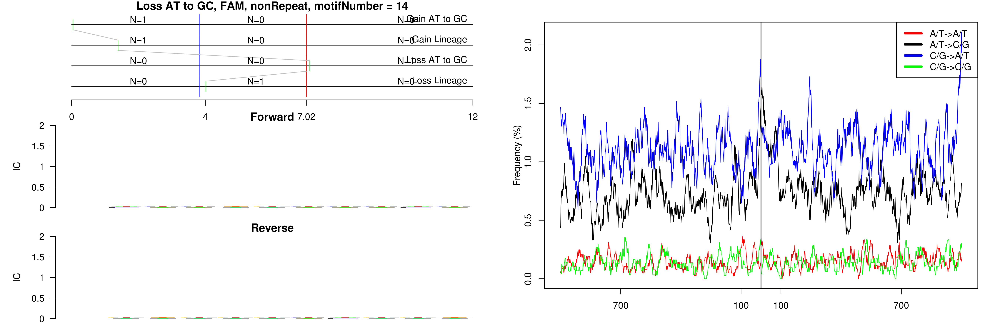 

```
## Loss AT to GC, FAM, nonRepeat, motifNumber = 15
```

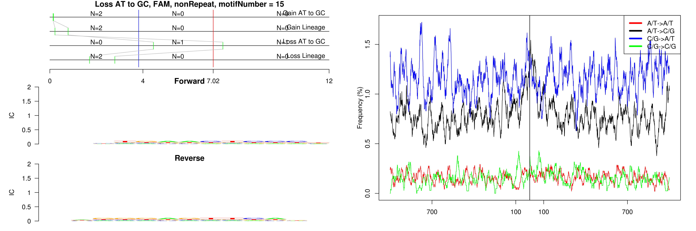 

```
## Loss AT to GC, FAM, nonRepeat, motifNumber = 16
```

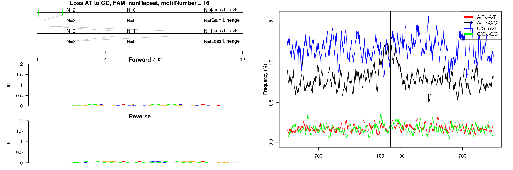 

```
## Loss AT to GC, FAM, nonRepeat, motifNumber = 17
```

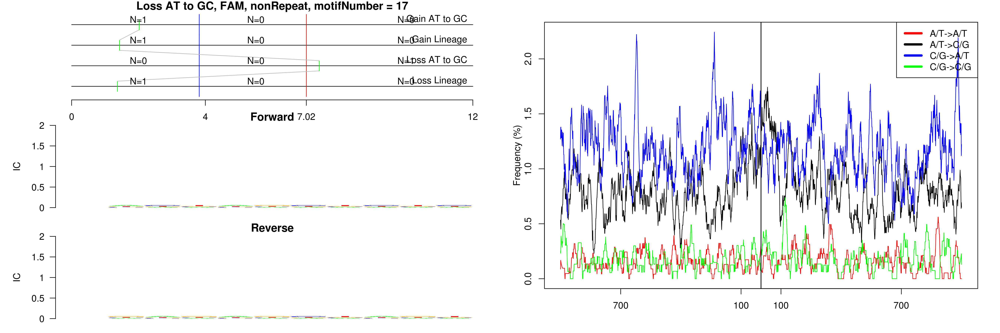 

```
## Loss AT to GC, FAM, nonRepeat, motifNumber = 18
```

 

```
## Loss AT to GC, FAM, nonRepeat, motifNumber = 19
```

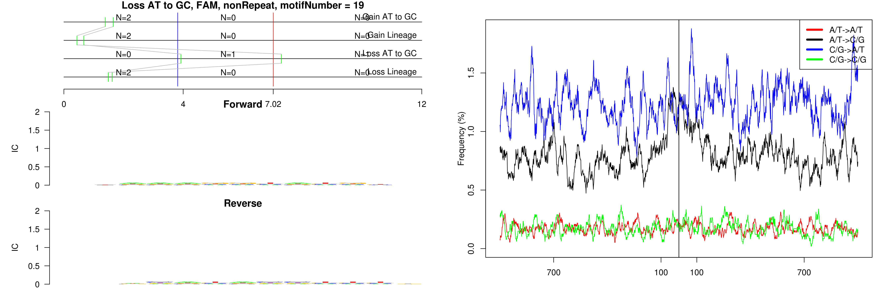 

```
## Loss AT to GC, FAM, ORR1B1-int, motifNumber = 1
```

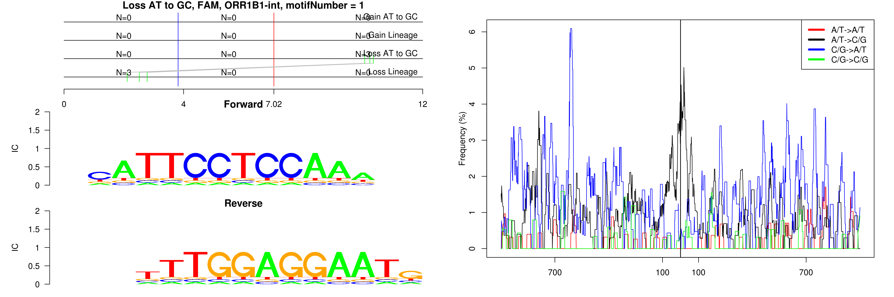 

```
## Loss AT to GC, FAM, RLTR15, motifNumber = 1
```

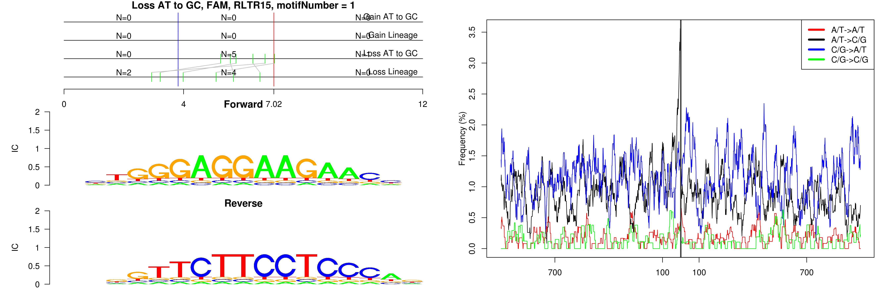 

```
## Loss AT to GC, FAM, RMER6C, motifNumber = 1
```

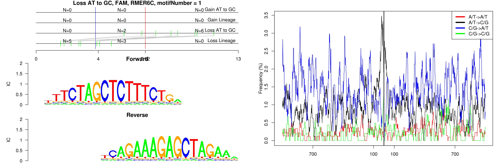 

```
## Loss AT to GC, FAM, (TCTA)n, motifNumber = 1
```

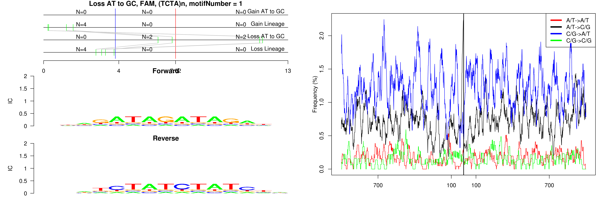 
  
