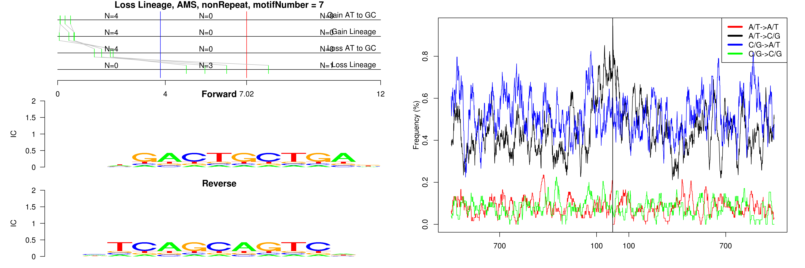

```
## Loss Lineage, AMS, B1_Mus1, motifNumber = 1
```

 

```
## Loss Lineage, AMS, B1_Mus2, motifNumber = 1
```

 

```
## Loss Lineage, AMS, B3, motifNumber = 1
```

 

```
## Loss Lineage, AMS, B3, motifNumber = 2
```

 

```
## Loss Lineage, AMS, B4, motifNumber = 1
```

 

```
## Loss Lineage, AMS, B4A, motifNumber = 1
```

 

```
## Loss Lineage, AMS, MTC, motifNumber = 1
```

 

```
## Loss Lineage, AMS, nonRepeat, motifNumber = 1
```

 

```
## Loss Lineage, AMS, nonRepeat, motifNumber = 2
```

 

```
## Loss Lineage, AMS, nonRepeat, motifNumber = 3
```

 

```
## Loss Lineage, AMS, nonRepeat, motifNumber = 4
```

 

```
## Loss Lineage, AMS, nonRepeat, motifNumber = 5
```

 

```
## Loss Lineage, AMS, nonRepeat, motifNumber = 6
```

 

```
## Loss Lineage, AMS, nonRepeat, motifNumber = 7
```

 

```
## Loss Lineage, AMS, RSINE1, motifNumber = 1
```

 
  
