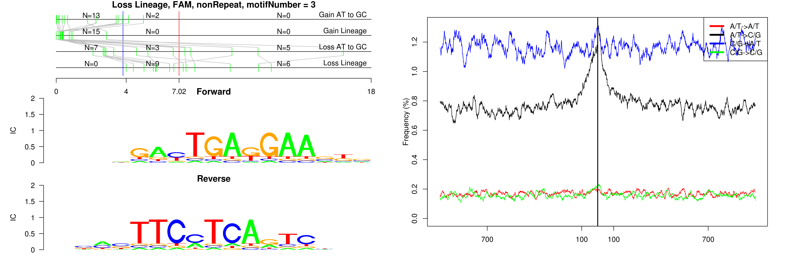

```
## Loss Lineage, FAM, ID_B1, motifNumber = 1
```

 

```
## Loss Lineage, FAM, Lx8, motifNumber = 1
```

 

```
## Loss Lineage, FAM, MTD, motifNumber = 1
```

 

```
## Loss Lineage, FAM, nonRepeat, motifNumber = 1
```

 

```
## Loss Lineage, FAM, nonRepeat, motifNumber = 2
```

 

```
## Loss Lineage, FAM, nonRepeat, motifNumber = 3
```

 

```
## Loss Lineage, FAM, nonRepeat, motifNumber = 4
```

 

```
## Loss Lineage, FAM, nonRepeat, motifNumber = 5
```

 

```
## Loss Lineage, FAM, nonRepeat, motifNumber = 6
```

 

```
## Loss Lineage, FAM, nonRepeat, motifNumber = 7
```

 

```
## Loss Lineage, FAM, nonRepeat, motifNumber = 8
```

 

```
## Loss Lineage, FAM, nonRepeat, motifNumber = 9
```

 

```
## Loss Lineage, FAM, nonRepeat, motifNumber = 10
```

 

```
## Loss Lineage, FAM, RSINE1, motifNumber = 1
```

 
  
