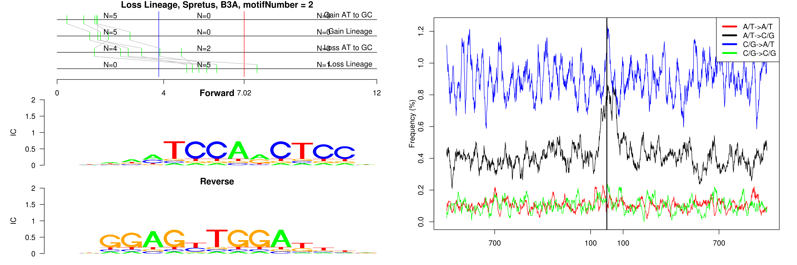
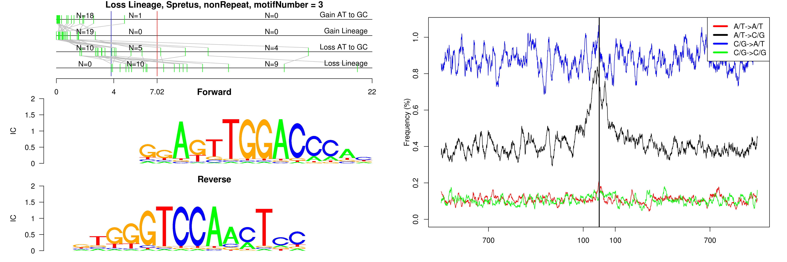
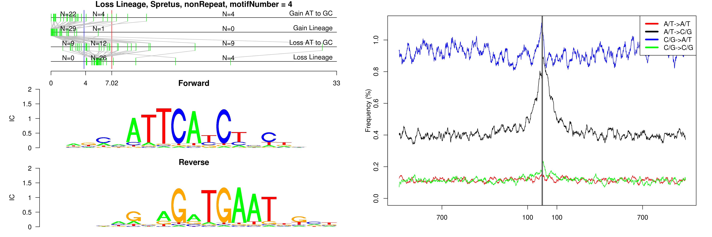
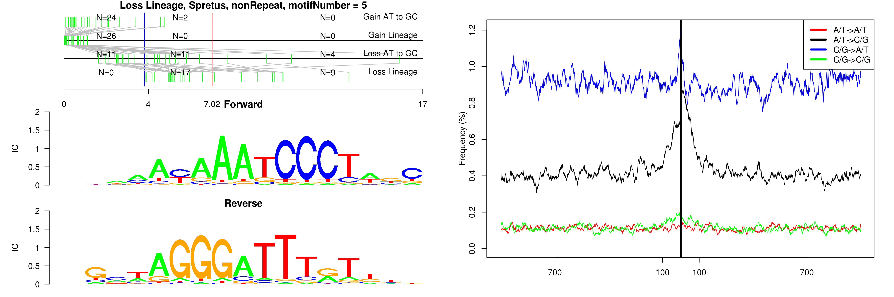
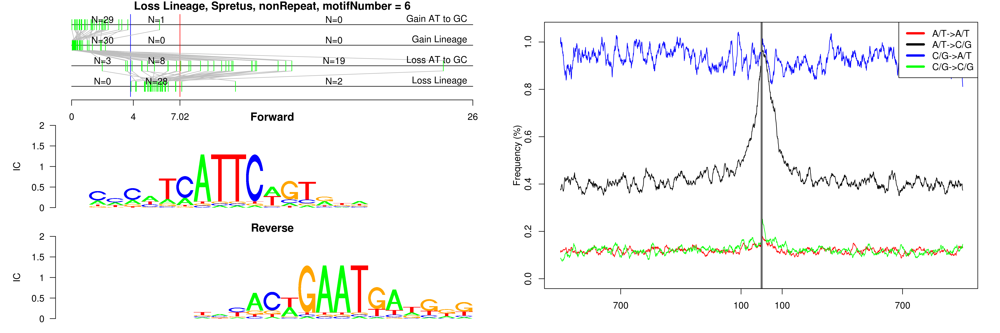
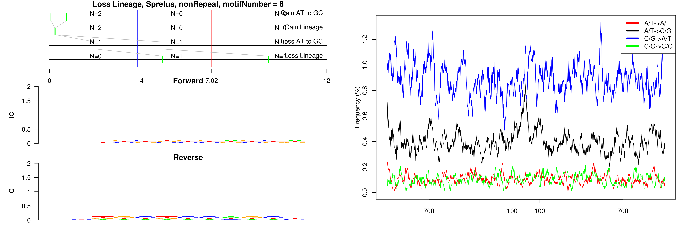
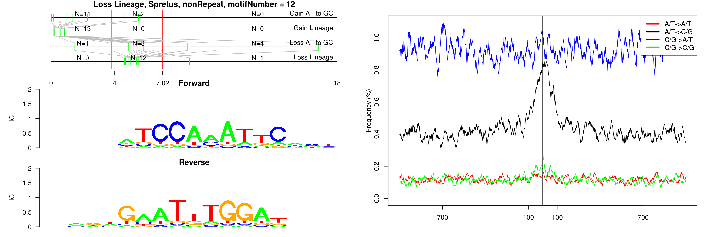
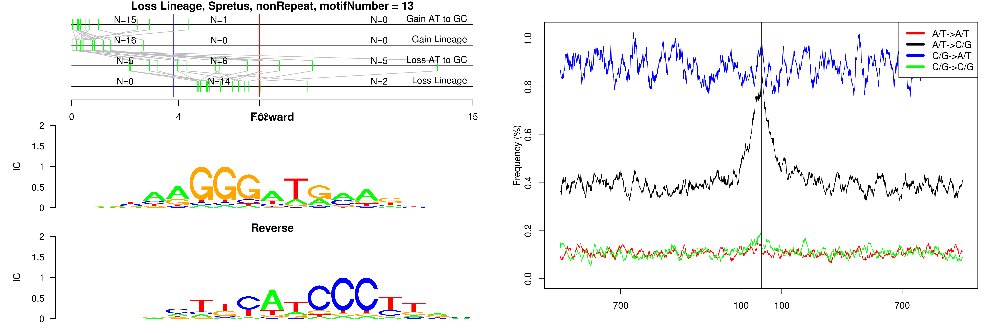
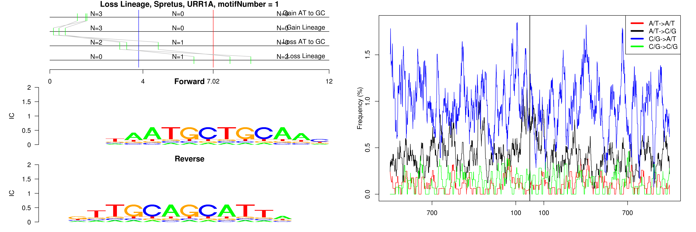

```
## Loss Lineage, Spretus, B3, motifNumber = 1
```

 

```
## Loss Lineage, Spretus, B3A, motifNumber = 1
```

 

```
## Loss Lineage, Spretus, B3A, motifNumber = 2
```

 

```
## Loss Lineage, Spretus, B4A, motifNumber = 1
```

 

```
## Loss Lineage, Spretus, B4A, motifNumber = 2
```

 

```
## Loss Lineage, Spretus, Lx2B, motifNumber = 1
```

 

```
## Loss Lineage, Spretus, Lx3C, motifNumber = 1
```

 

```
## Loss Lineage, Spretus, Lx9, motifNumber = 1
```

 

```
## Loss Lineage, Spretus, nonRepeat, motifNumber = 1
```

 

```
## Loss Lineage, Spretus, nonRepeat, motifNumber = 2
```

 

```
## Loss Lineage, Spretus, nonRepeat, motifNumber = 3
```

 

```
## Loss Lineage, Spretus, nonRepeat, motifNumber = 4
```

 

```
## Loss Lineage, Spretus, nonRepeat, motifNumber = 5
```

 

```
## Loss Lineage, Spretus, nonRepeat, motifNumber = 6
```

 

```
## Loss Lineage, Spretus, nonRepeat, motifNumber = 7
```

 

```
## Loss Lineage, Spretus, nonRepeat, motifNumber = 8
```

 

```
## Loss Lineage, Spretus, nonRepeat, motifNumber = 9
```

 

```
## Loss Lineage, Spretus, nonRepeat, motifNumber = 10
```

 

```
## Loss Lineage, Spretus, nonRepeat, motifNumber = 11
```

 

```
## Loss Lineage, Spretus, nonRepeat, motifNumber = 12
```

 

```
## Loss Lineage, Spretus, nonRepeat, motifNumber = 13
```

 

```
## Loss Lineage, Spretus, RMER17C, motifNumber = 1
```

 

```
## Loss Lineage, Spretus, RSINE1, motifNumber = 1
```

 

```
## Loss Lineage, Spretus, (TG)n, motifNumber = 1
```

 

```
## Loss Lineage, Spretus, (TTC)n, motifNumber = 1
```

 

```
## Loss Lineage, Spretus, URR1A, motifNumber = 1
```

 
  
