```
## Gain AT to GC, FAM, (CA)n, motifNumber = 1
```

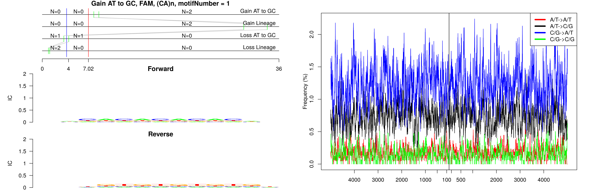

```
## Gain AT to GC, FAM, (TCTA)n, motifNumber = 1
```

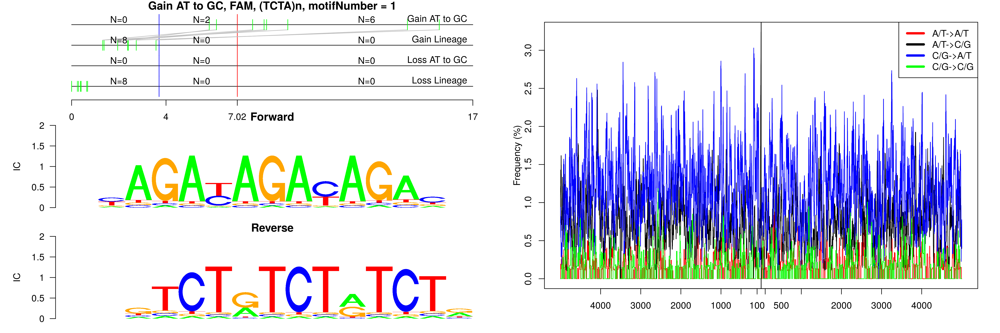

```
## Gain AT to GC, FAM, B1_Mus1, motifNumber = 1
```

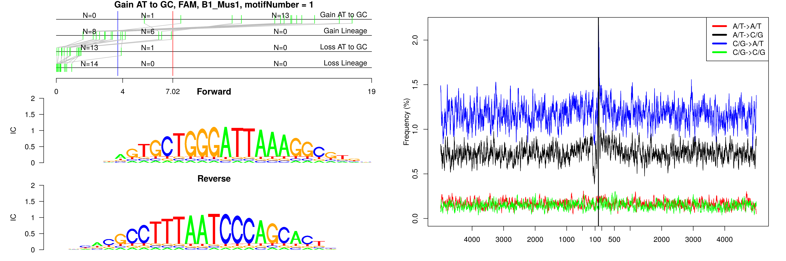

```
## Gain AT to GC, FAM, B1_Mus1, motifNumber = 2
```

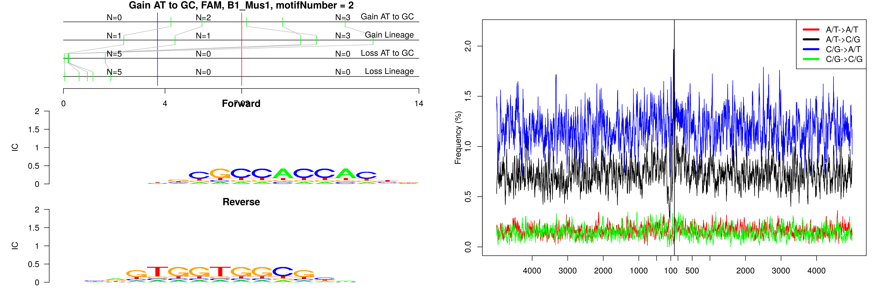

```
## Gain AT to GC, FAM, B1_Mus2, motifNumber = 1
```

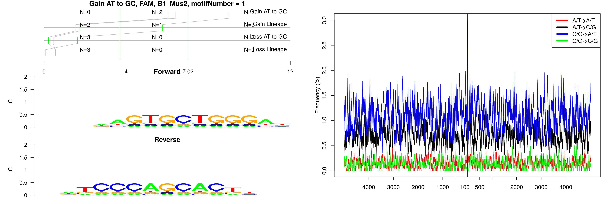

```
## Gain AT to GC, FAM, B2_Mm2, motifNumber = 1
```

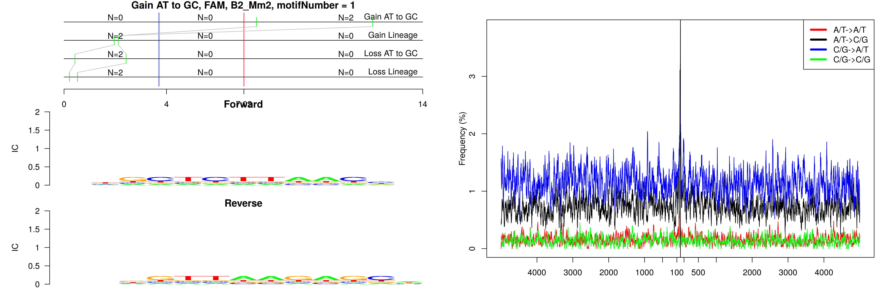

```
## Gain AT to GC, FAM, B2_Mm2, motifNumber = 2
```

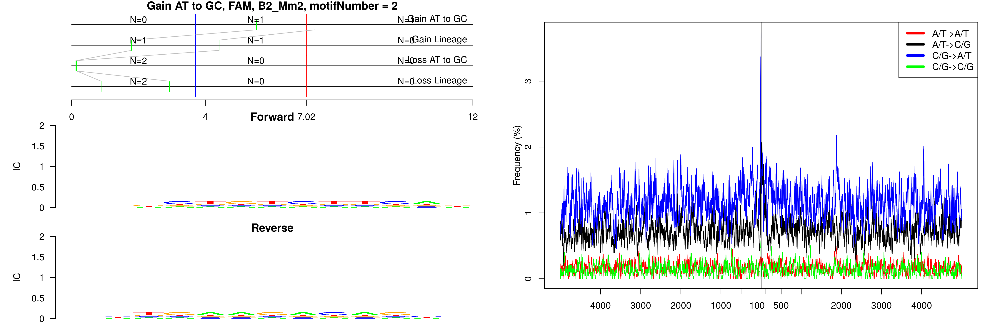

```
## Gain AT to GC, FAM, B2_Mm2, motifNumber = 3
```

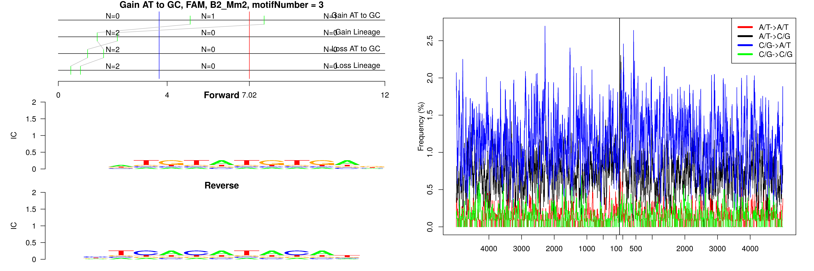

```
## Gain AT to GC, FAM, ID_B1, motifNumber = 1
```

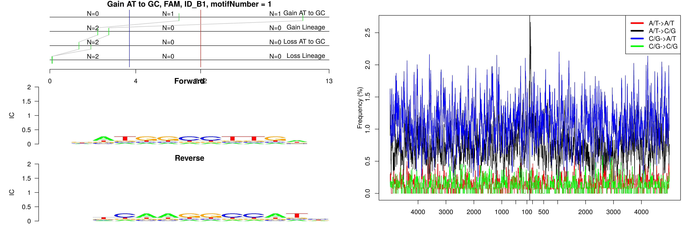

```
## Gain AT to GC, FAM, nonRepeat, motifNumber = 1
```

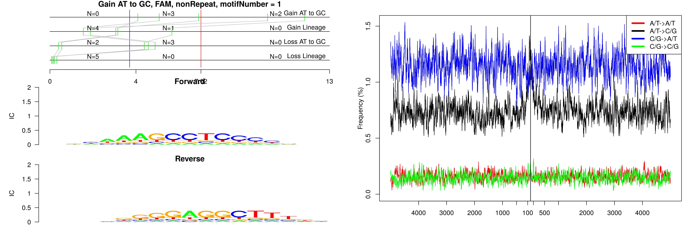

```
## Gain AT to GC, FAM, nonRepeat, motifNumber = 2
```

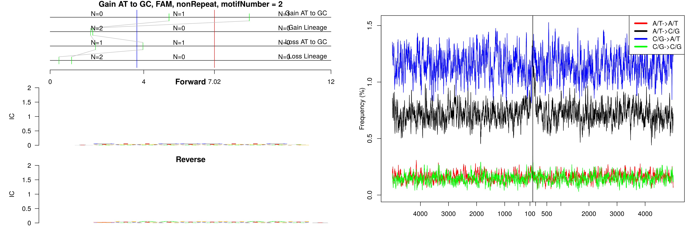

```
## Gain AT to GC, FAM, nonRepeat, motifNumber = 3
```

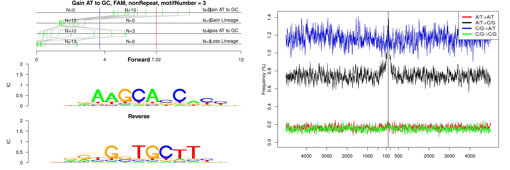

```
## Gain AT to GC, FAM, nonRepeat, motifNumber = 4
```

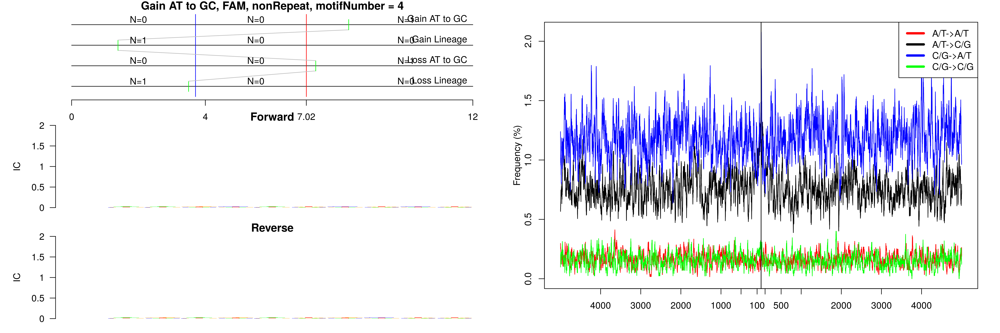

```
## Gain AT to GC, FAM, nonRepeat, motifNumber = 5
```

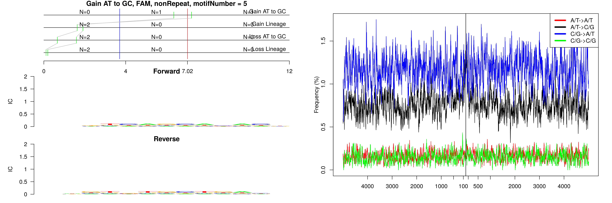

```
## Gain AT to GC, FAM, nonRepeat, motifNumber = 6
```

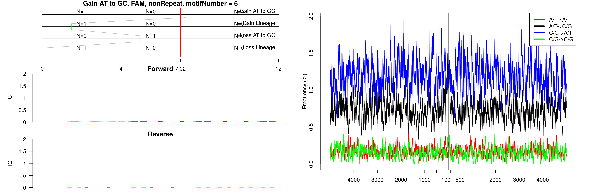
  
