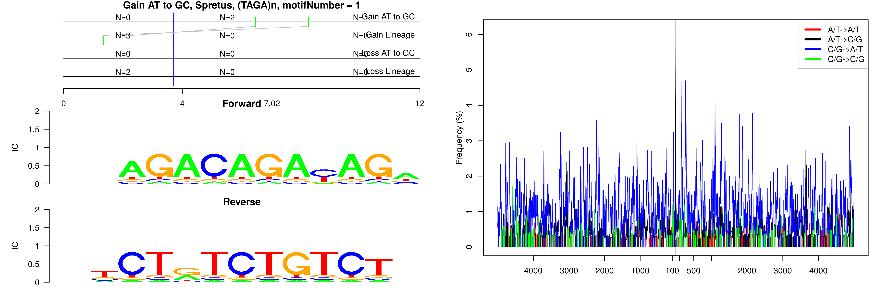
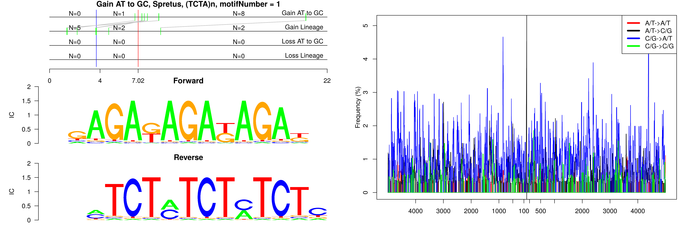
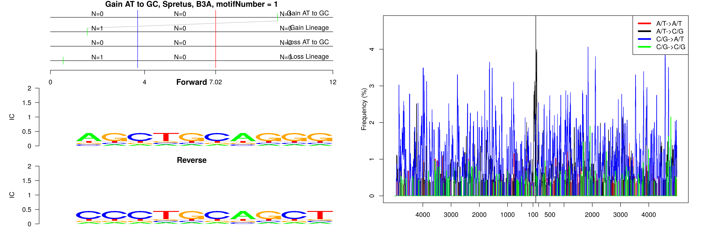
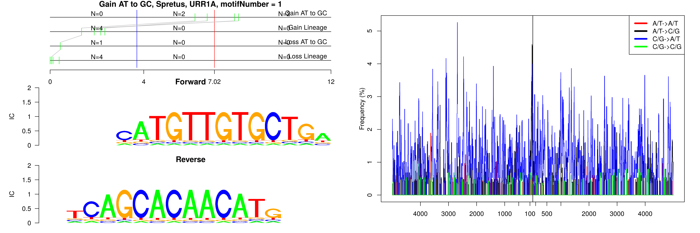
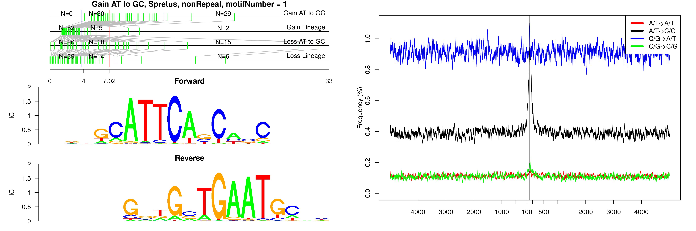
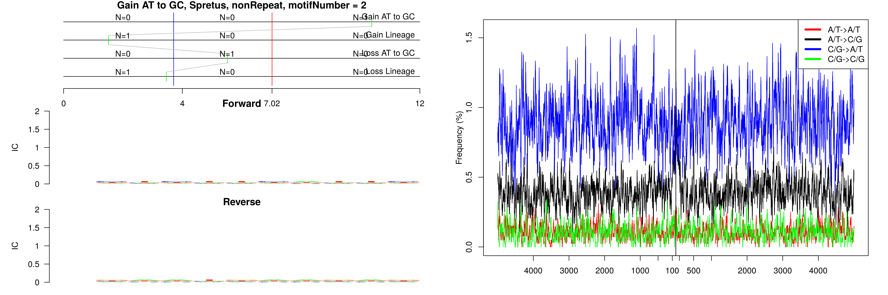
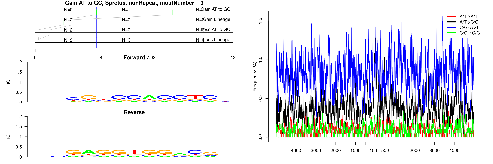
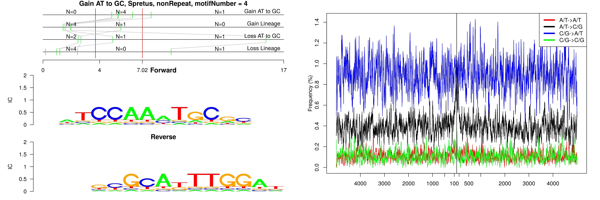
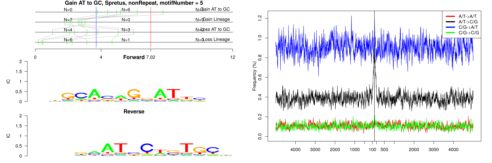
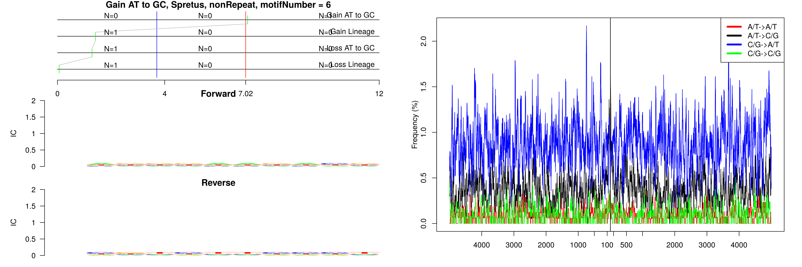

```
## Gain AT to GC, Spretus, (TAGA)n, motifNumber = 1
```



```
## Gain AT to GC, Spretus, (TCTA)n, motifNumber = 1
```



```
## Gain AT to GC, Spretus, B3A, motifNumber = 1
```



```
## Gain AT to GC, Spretus, URR1A, motifNumber = 1
```



```
## Gain AT to GC, Spretus, nonRepeat, motifNumber = 1
```



```
## Gain AT to GC, Spretus, nonRepeat, motifNumber = 2
```



```
## Gain AT to GC, Spretus, nonRepeat, motifNumber = 3
```



```
## Gain AT to GC, Spretus, nonRepeat, motifNumber = 4
```



```
## Gain AT to GC, Spretus, nonRepeat, motifNumber = 5
```



```
## Gain AT to GC, Spretus, nonRepeat, motifNumber = 6
```


  
