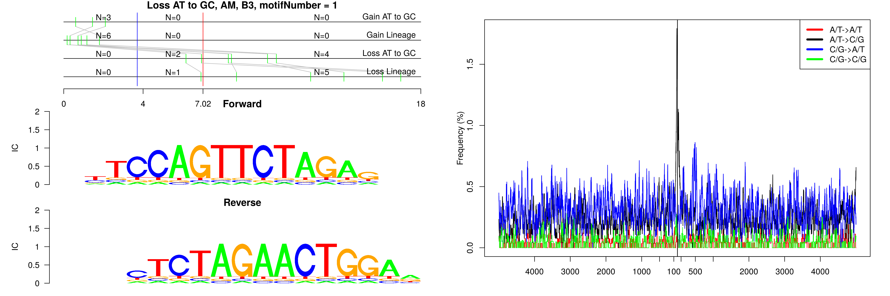
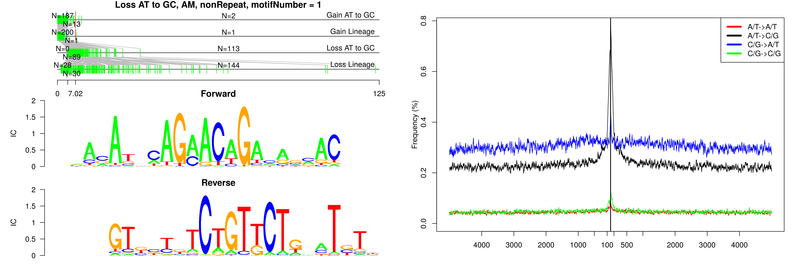
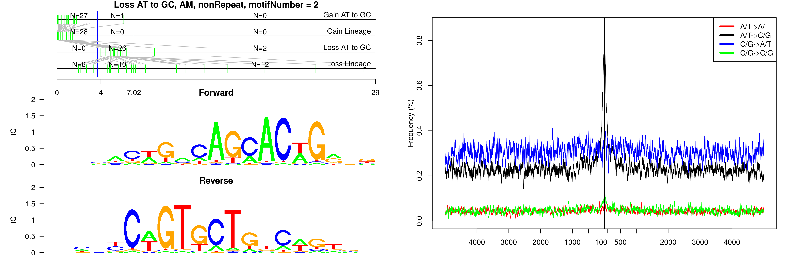
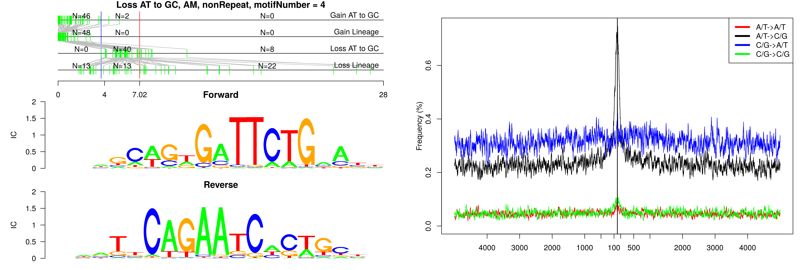
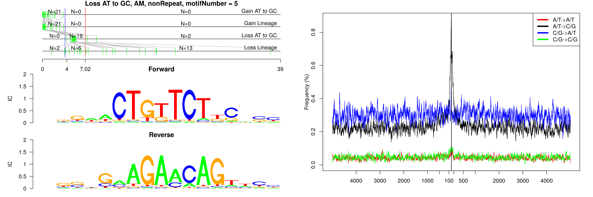
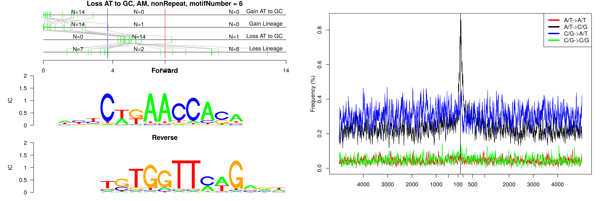
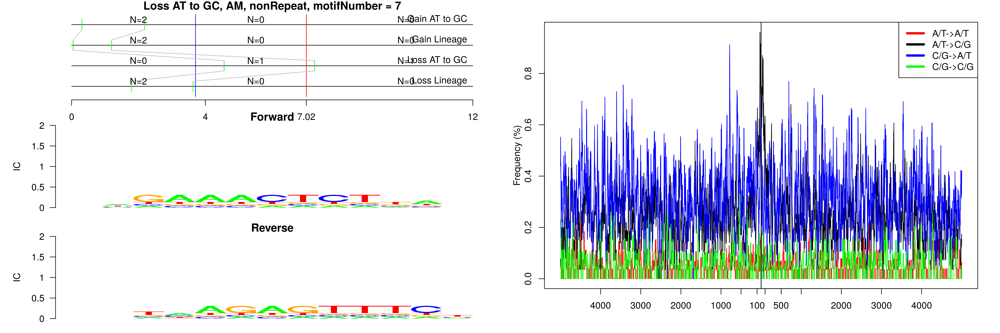
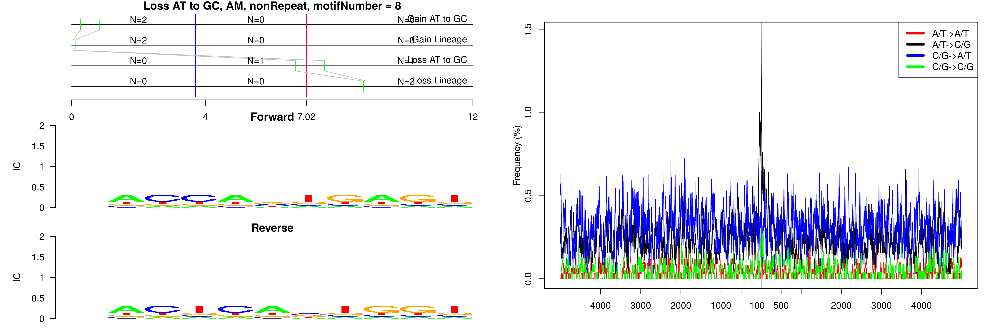

```
## Loss AT to GC, AM, B3, motifNumber = 1
```



```
## Loss AT to GC, AM, nonRepeat, motifNumber = 1
```



```
## Loss AT to GC, AM, nonRepeat, motifNumber = 2
```



```
## Loss AT to GC, AM, nonRepeat, motifNumber = 3
```


```
## Loss AT to GC, AM, nonRepeat, motifNumber = 4
```



```
## Loss AT to GC, AM, nonRepeat, motifNumber = 5
```



```
## Loss AT to GC, AM, nonRepeat, motifNumber = 6
```



```
## Loss AT to GC, AM, nonRepeat, motifNumber = 7
```



```
## Loss AT to GC, AM, nonRepeat, motifNumber = 8
```


  
