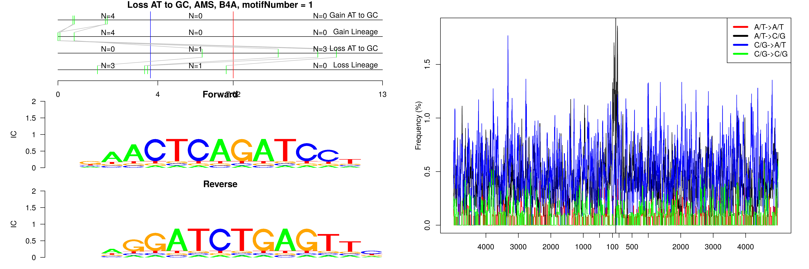
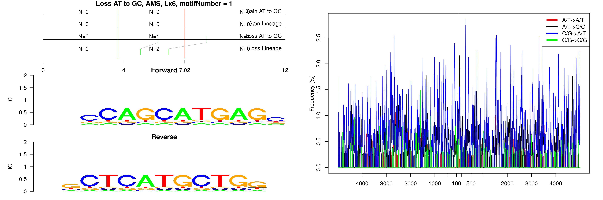
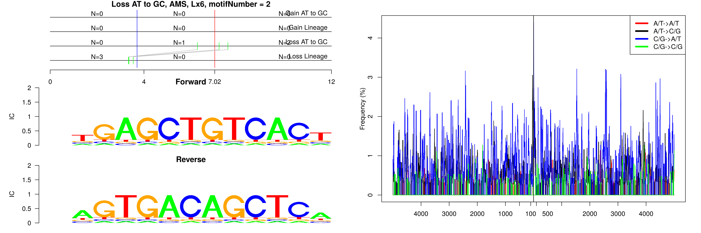
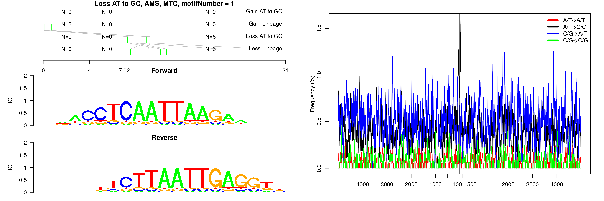
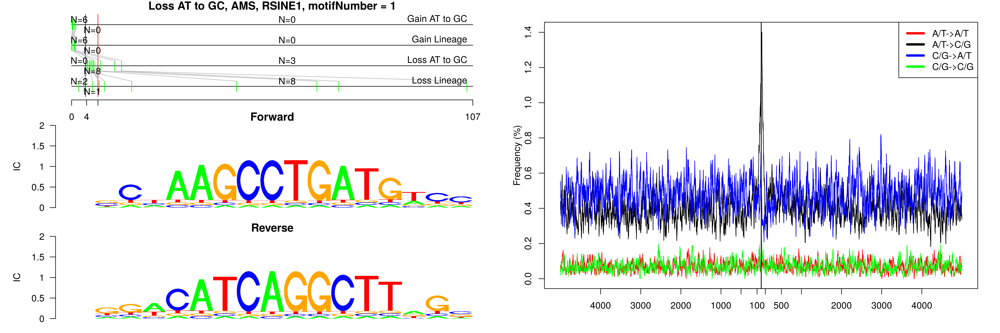
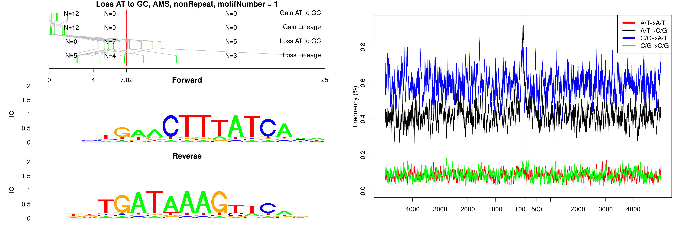
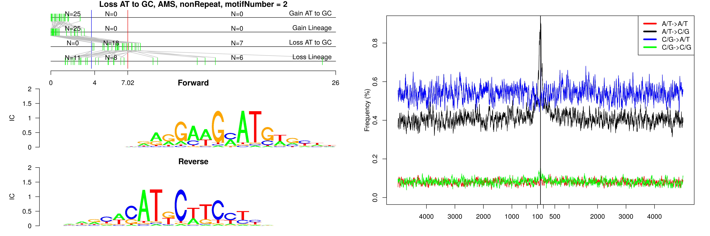
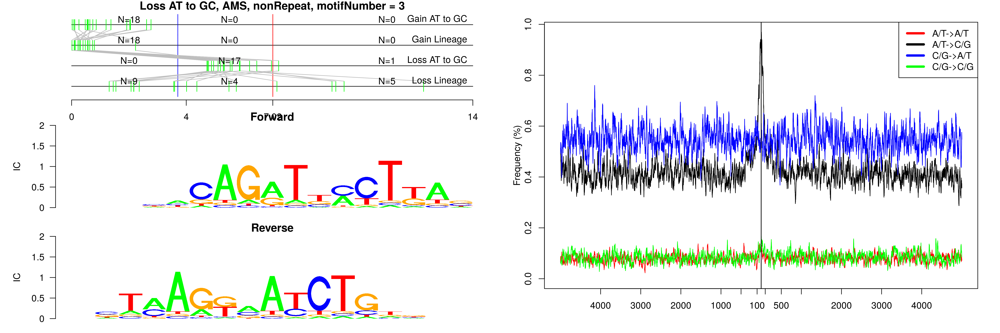

```
## Loss AT to GC, AMS, B4A, motifNumber = 1
```



```
## Loss AT to GC, AMS, Lx6, motifNumber = 1
```



```
## Loss AT to GC, AMS, Lx6, motifNumber = 2
```



```
## Loss AT to GC, AMS, MTC, motifNumber = 1
```



```
## Loss AT to GC, AMS, RSINE1, motifNumber = 1
```



```
## Loss AT to GC, AMS, nonRepeat, motifNumber = 1
```



```
## Loss AT to GC, AMS, nonRepeat, motifNumber = 2
```



```
## Loss AT to GC, AMS, nonRepeat, motifNumber = 3
```


  
