```
## Loss AT to GC, FAM, (GAA)n, motifNumber = 1
```

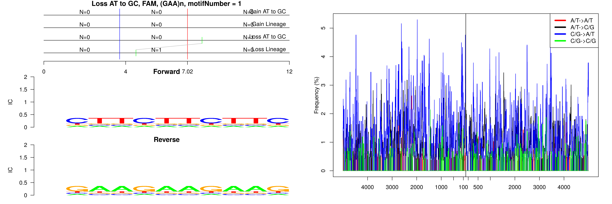

```
## Loss AT to GC, FAM, (TCTA)n, motifNumber = 1
```

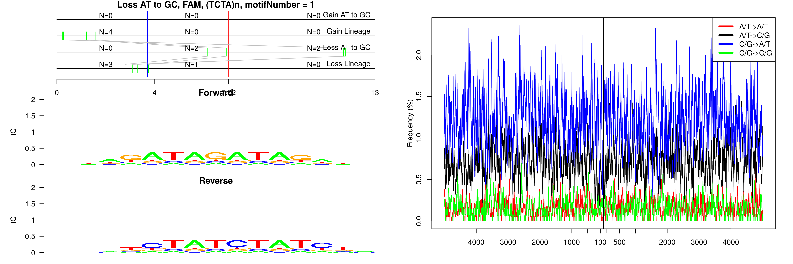

```
## Loss AT to GC, FAM, B1_Mus1, motifNumber = 1
```

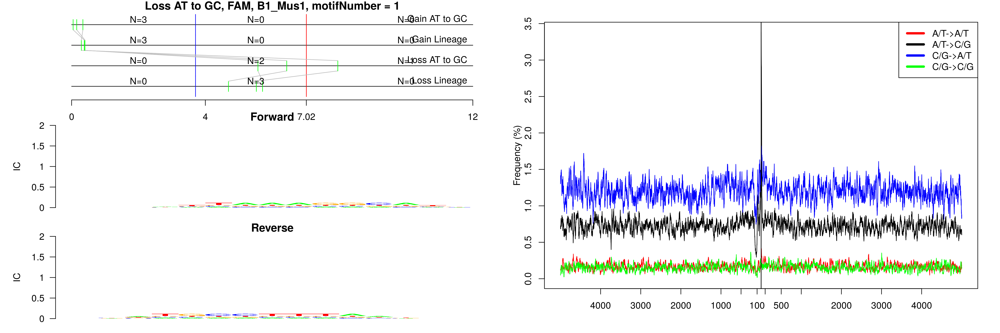

```
## Loss AT to GC, FAM, Lx8, motifNumber = 1
```

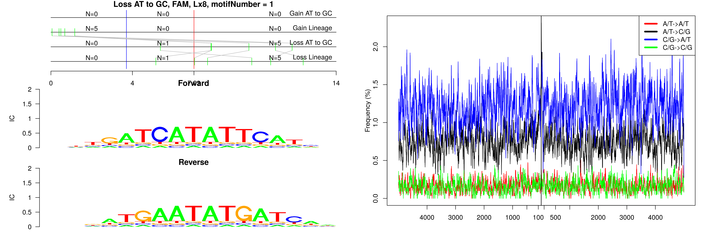

```
## Loss AT to GC, FAM, MTC, motifNumber = 1
```

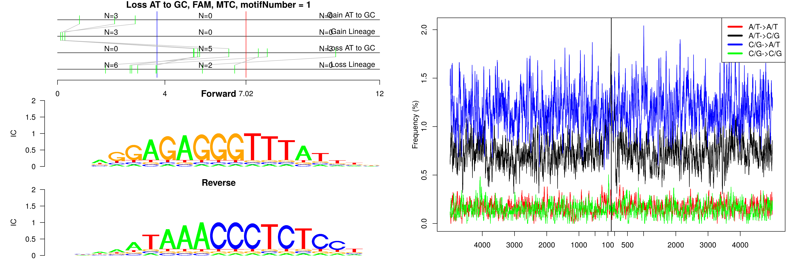

```
## Loss AT to GC, FAM, ORR1B1-int, motifNumber = 1
```

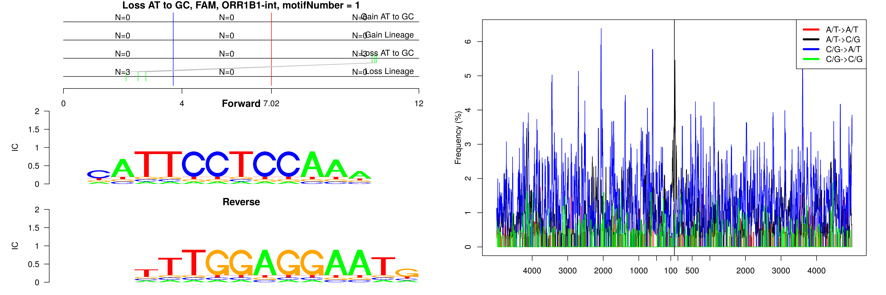

```
## Loss AT to GC, FAM, RLTR15, motifNumber = 1
```

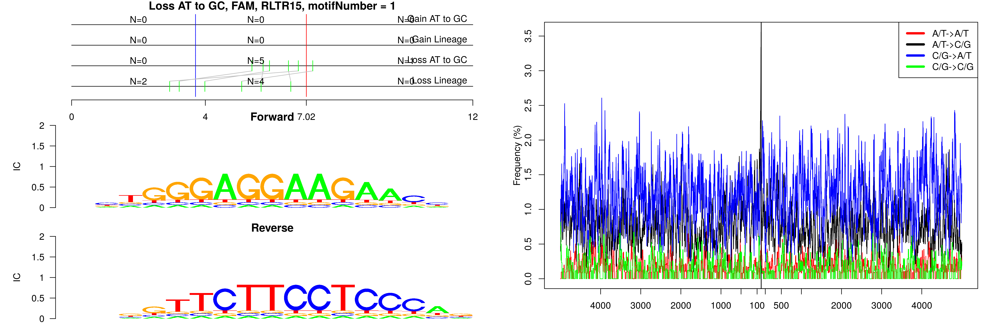

```
## Loss AT to GC, FAM, RMER6C, motifNumber = 1
```

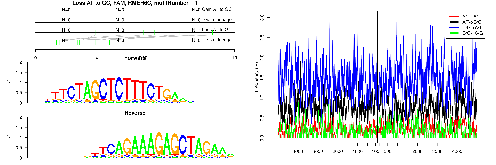

```
## Loss AT to GC, FAM, RSINE1, motifNumber = 1
```

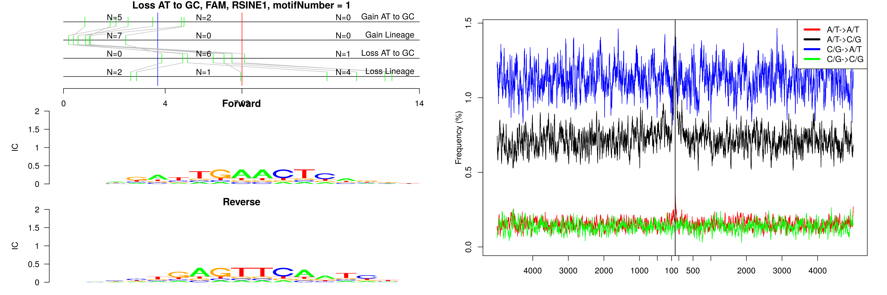

```
## Loss AT to GC, FAM, nonRepeat, motifNumber = 1
```

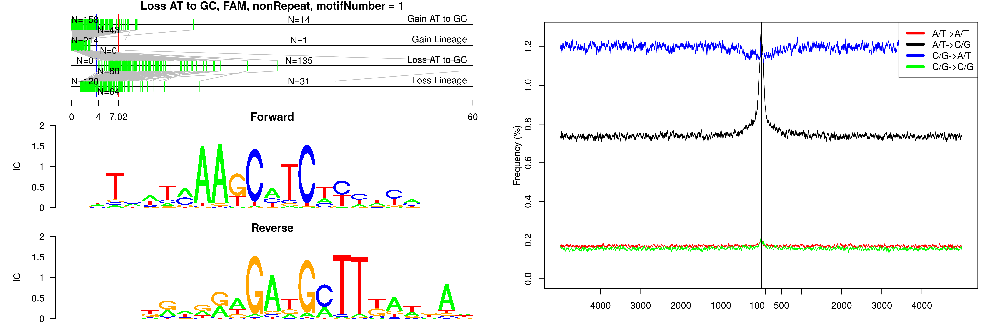

```
## Loss AT to GC, FAM, nonRepeat, motifNumber = 2
```


```
## Loss AT to GC, FAM, nonRepeat, motifNumber = 3
```

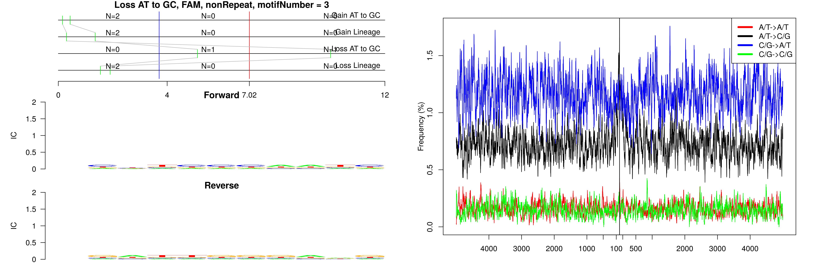

```
## Loss AT to GC, FAM, nonRepeat, motifNumber = 4
```

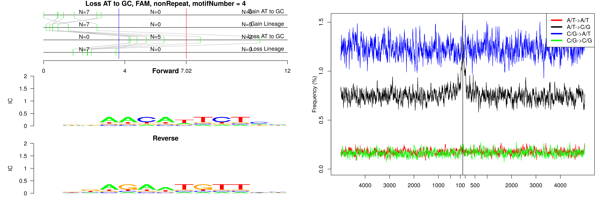

```
## Loss AT to GC, FAM, nonRepeat, motifNumber = 5
```

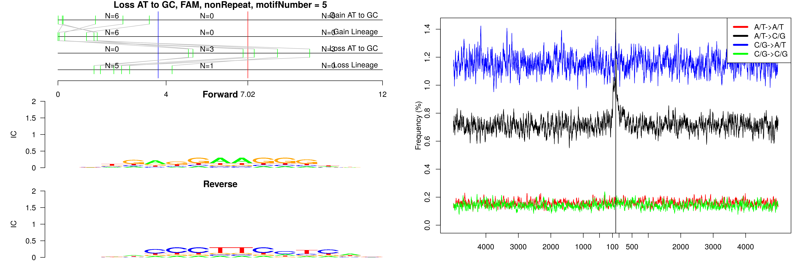

```
## Loss AT to GC, FAM, nonRepeat, motifNumber = 6
```

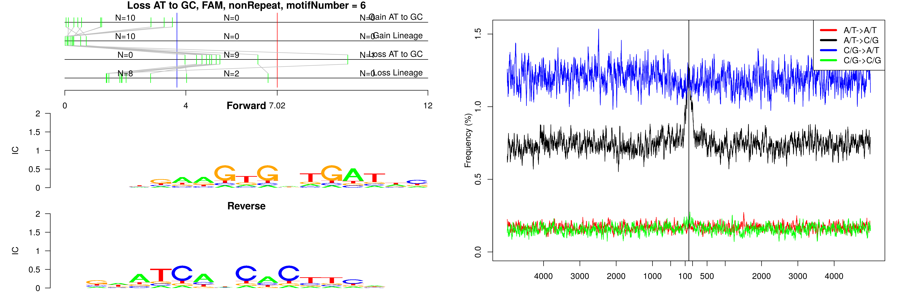

```
## Loss AT to GC, FAM, nonRepeat, motifNumber = 7
```

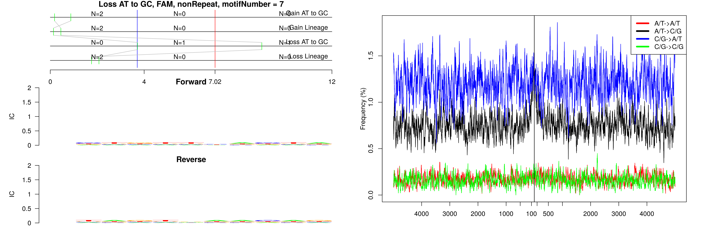

```
## Loss AT to GC, FAM, nonRepeat, motifNumber = 8
```

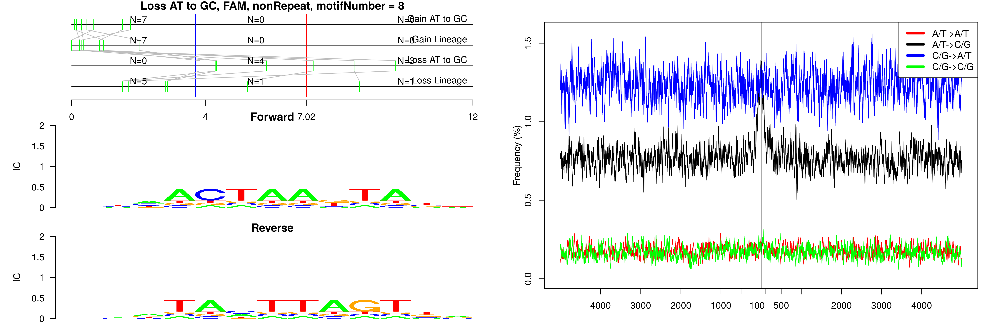

```
## Loss AT to GC, FAM, nonRepeat, motifNumber = 9
```


```
## Loss AT to GC, FAM, nonRepeat, motifNumber = 10
```

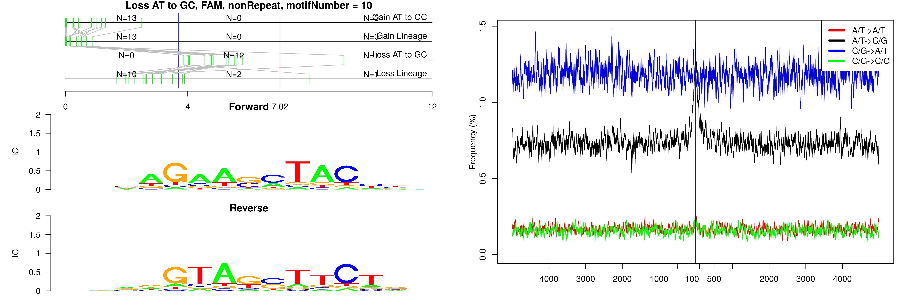

```
## Loss AT to GC, FAM, nonRepeat, motifNumber = 11
```

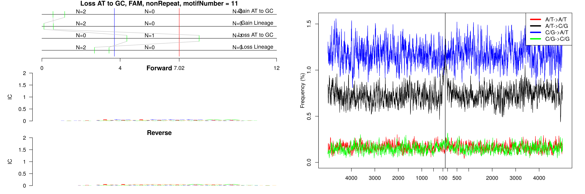

```
## Loss AT to GC, FAM, nonRepeat, motifNumber = 12
```

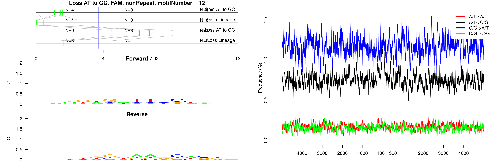

```
## Loss AT to GC, FAM, nonRepeat, motifNumber = 13
```

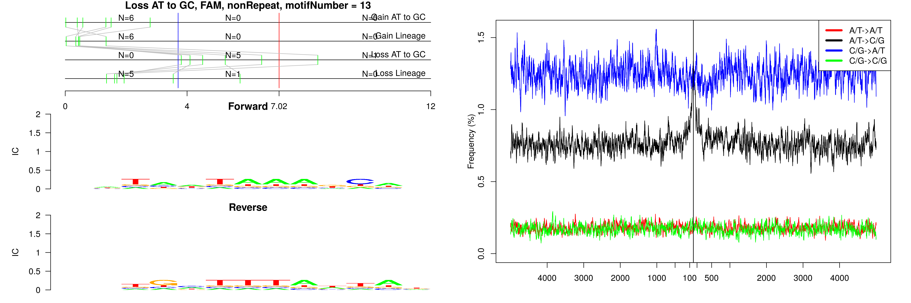

```
## Loss AT to GC, FAM, nonRepeat, motifNumber = 14
```

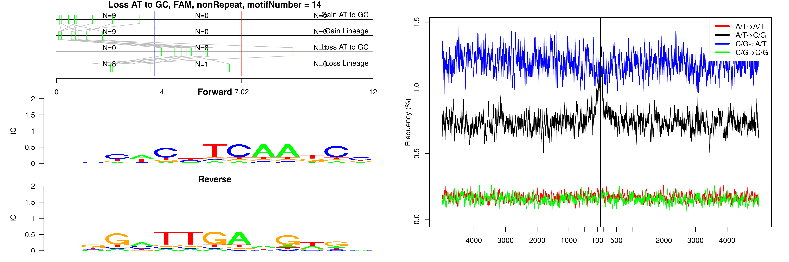

```
## Loss AT to GC, FAM, nonRepeat, motifNumber = 15
```

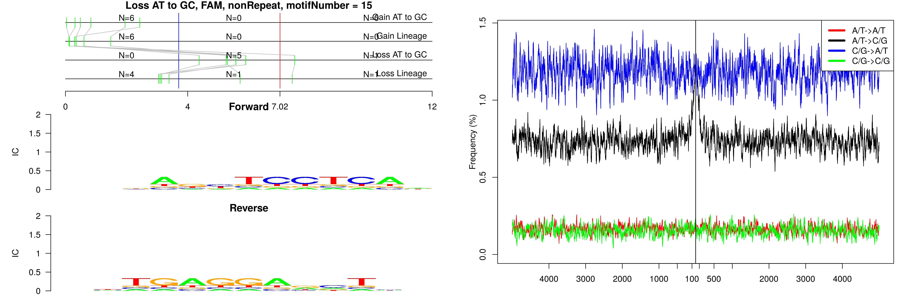

```
## Loss AT to GC, FAM, nonRepeat, motifNumber = 16
```

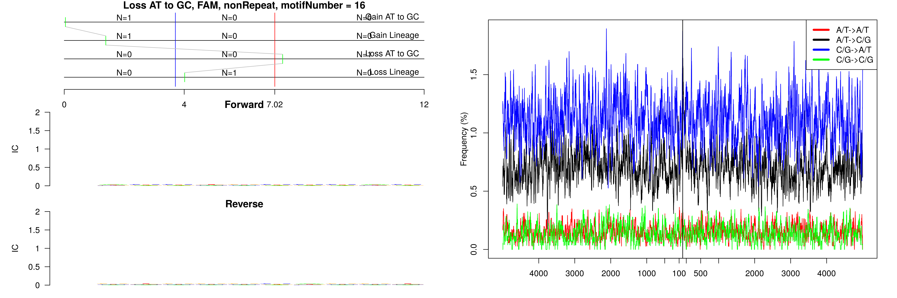

```
## Loss AT to GC, FAM, nonRepeat, motifNumber = 17
```

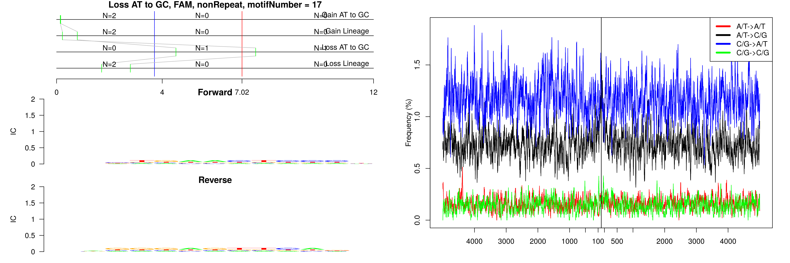

```
## Loss AT to GC, FAM, nonRepeat, motifNumber = 18
```

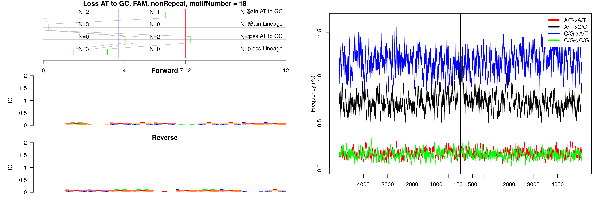

```
## Loss AT to GC, FAM, nonRepeat, motifNumber = 19
```


```
## Loss AT to GC, FAM, nonRepeat, motifNumber = 20
```

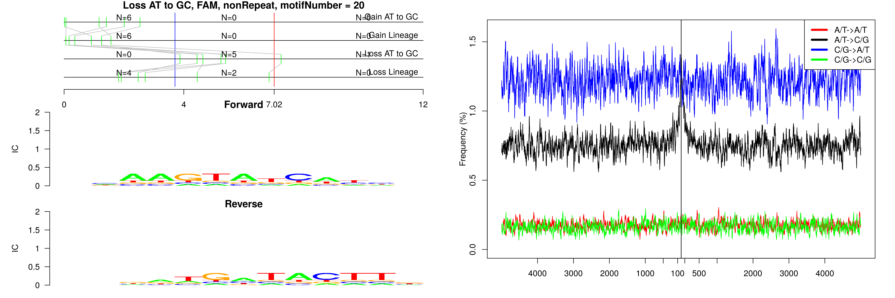

```
## Loss AT to GC, FAM, nonRepeat, motifNumber = 21
```

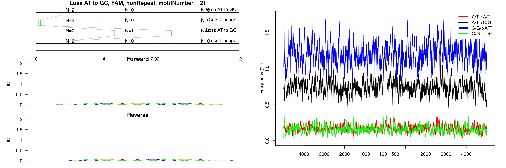

```
## Loss AT to GC, FAM, nonRepeat, motifNumber = 22
```

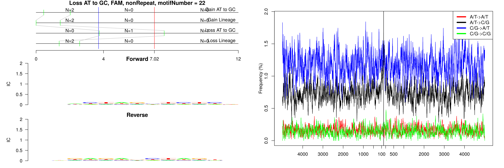

```
## Loss AT to GC, FAM, nonRepeat, motifNumber = 23
```

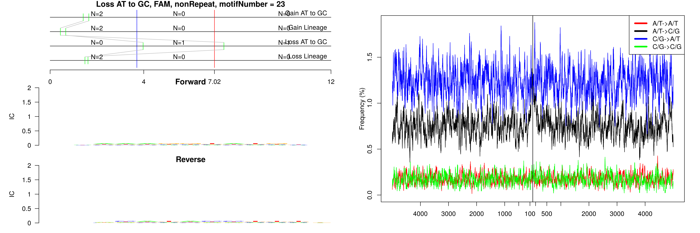
  
