```
## Loss Lineage, AM, B3, motifNumber = 1
```

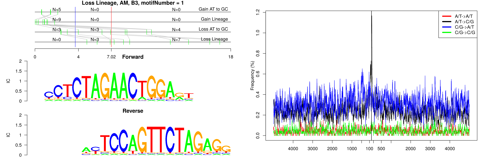

```
## Loss Lineage, AM, B3, motifNumber = 2
```

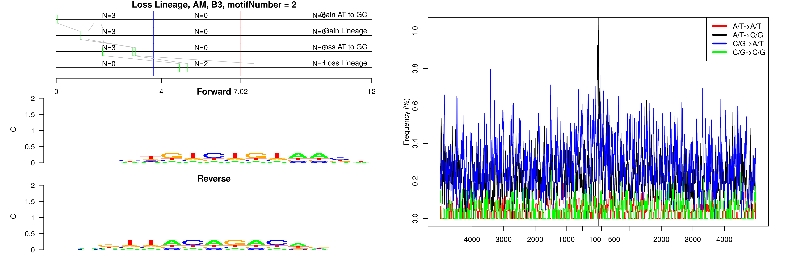

```
## Loss Lineage, AM, ID_B1, motifNumber = 1
```


```
## Loss Lineage, AM, ID_B1, motifNumber = 2
```

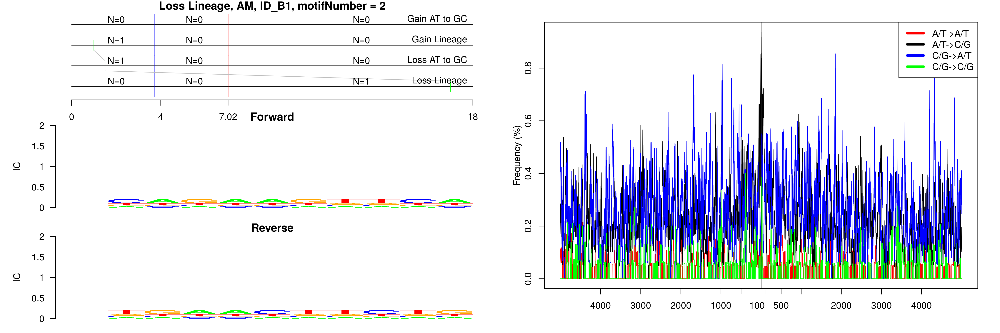

```
## Loss Lineage, AM, ID_B1, motifNumber = 3
```

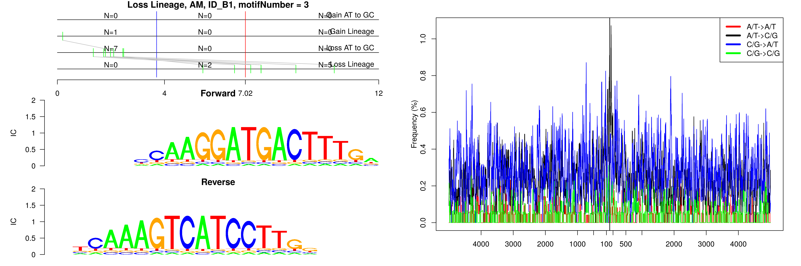

```
## Loss Lineage, AM, ID_B1, motifNumber = 4
```

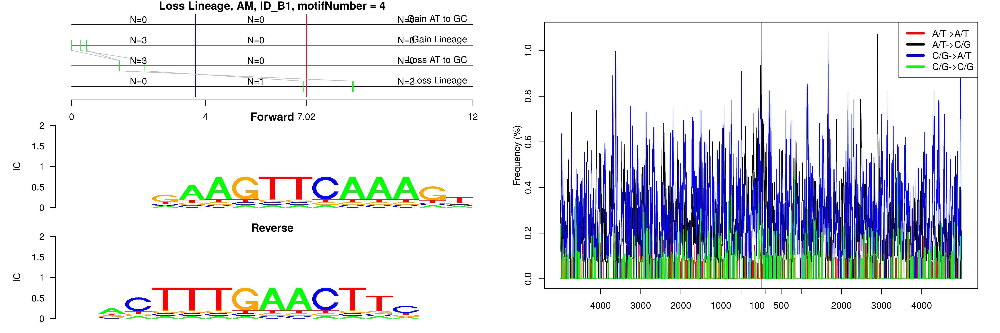

```
## Loss Lineage, AM, RSINE1, motifNumber = 1
```

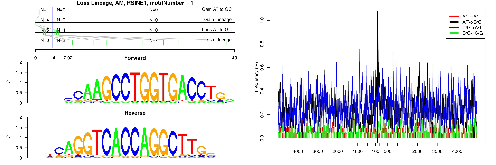

```
## Loss Lineage, AM, nonRepeat, motifNumber = 1
```

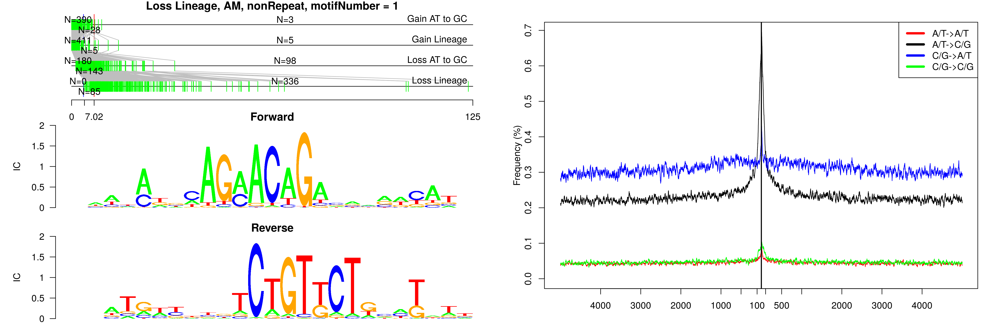

```
## Loss Lineage, AM, nonRepeat, motifNumber = 2
```

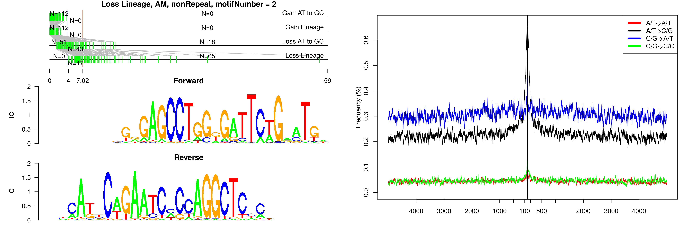

```
## Loss Lineage, AM, nonRepeat, motifNumber = 3
```

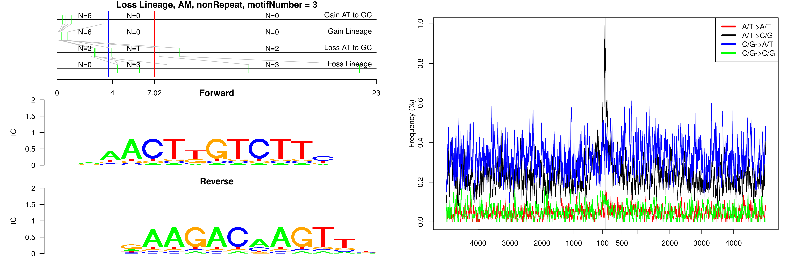

```
## Loss Lineage, AM, nonRepeat, motifNumber = 4
```

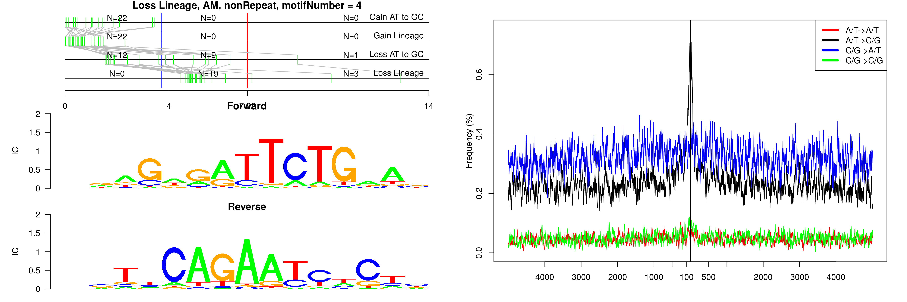

```
## Loss Lineage, AM, nonRepeat, motifNumber = 5
```

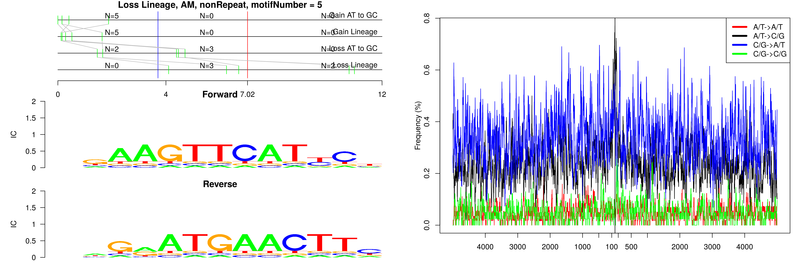

```
## Loss Lineage, AM, nonRepeat, motifNumber = 6
```

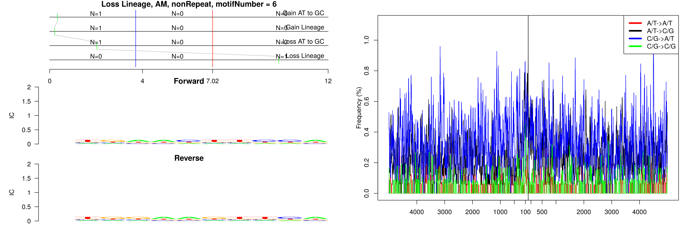

```
## Loss Lineage, AM, nonRepeat, motifNumber = 7
```

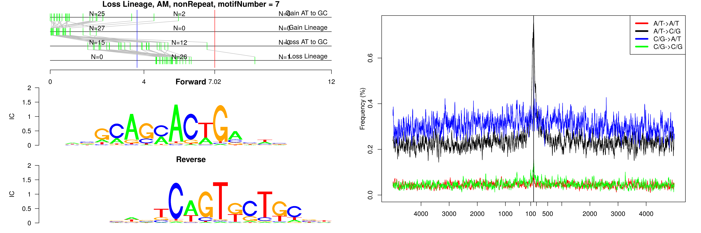
  
